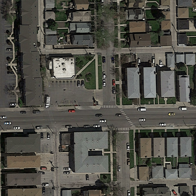
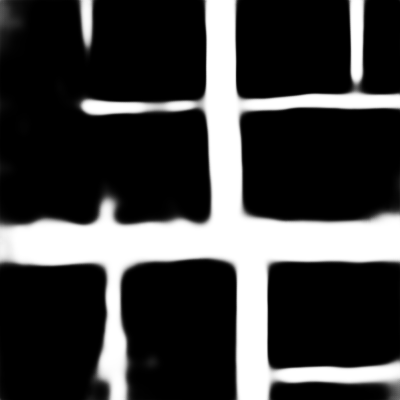
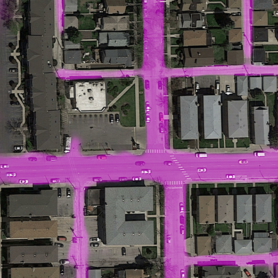

# CIL Project 2019: Road Segmentation

## Contributors 
- [Christian Bohn](cbohn@student.ethz.ch)
- [Cyril Schroeder](cyrils@student.ethz.ch)
- [Olivier Bitter](bittero@student.ethz.ch)
- [Roknoddin Azizibarzoki](azizibar@student.ethz.ch)


## Project Description
The task was to solve the problem of segmenting satellite images into "road pixels" 
and "non-road pixels".

We were provided with 100 aerial images, 100 corresponding
pre-labelled groundtruth images and 94 unlabelled satellite images for our final 
predictions that were submitted to the Kaggle Competition.


| Type           | Amount | Shape          |
| -------------- | ------ |--------------- |
| Training Img   | 100    | (400, 400, 3)  |
| Training Label | 100    | (400, 400, 1)  |
| Test Img       | 94     | (608, 608, 3)  |


## Our Solution
We implemented an improved version of the U-Net Architecture from 
[Ronneberger et al. (2015)](https://arxiv.org/pdf/1505.04597.pdf) using 
T[Tensorflow](https://www.tensorflow.org/) and applied various preprocessing and
data augmentation methods to improve the quality of the model.

The public and private F1-scores of our best submission for the Kaggle Competition
were 90.52% and 89.61%, respectively correspondingto ranks 13 and 6 out of 30 
participating teams.







## Directory Structure

The root folder contains the following:

```
cil-project
├── model_architecture/   --> All baseline and u_net models
├── utilities/            --> Various helper modules (bagging, whitening, aug etc)
|
├──training.py            --> For training the model
├──predict.py             --> For predicting on a trained model
└──config.py              --> For setting the hyperparameters before training
                              and specifying the models to predict on.
```


## Usage

### Training
1.  Tweak the hyperparameters in the 'Training' section of the config.py file
    to your likings.
2.  Inside the project root directory run
    `python training.py`


The training losses and accuracies for every batch will be printed on the go,
as well as the validation losses and accuracies after every epoch.
If the validation accuracy reached a new high at the end of an epoch, the 
wheights of this epoch will be saved in the 'model_files' directory with 
the following format:

`{TIMESTAMP}-{EPOCH_NUM}`

Only the best three epochs will be stored in order to keep memory consumption 
low. If the accuracy does not improve whithin t epochs, where t is the patience
value specified in the config.py file, the training will stop. If the accuracy
keeps increasing, the training will stop after reaching the upper bound of epochs,
which also has to be specified in the config.py file.
    

### Prediction
1.  Specify the model to use for prediction by setting the according parameters
    in the'Prediction' section of the config.py file.
2.  Inside the project root directory run
    `python predict.py`

A detailed explanation of how to prepare the config.py file for the prediction 
is given in the config.py file.


## Utility Programs

Inside the 'utilities/' directory various utility programs are found that helped us
preprocessing the images as well as creating images for the report.
The scripts that can be run directly are:

- `whiten.py`: Creates the whitened images in the data directory (as those files are already created by default, there is no need to run this script again).
- `predict_on_val.py`: Creates predictions of the validation images (opposed to the test images, which get predicted in 'predict.py). This was usefull to create images for the report, as we could compare them to correspondning groundtruth images.
- `report_images.py`: Creates overlay and difference images that were used in the report. 
- `bagging.py`: Creates the bagged predictions from a collection of prediction from different models.

ATTENTION: The above scripts have to be run from while in the root directory as otherwise some dependencies might not get loaded correctly.
For example, run the `predict_on_val.py` by typing: `python utilities/predict_on_val.py` from the root directory.


